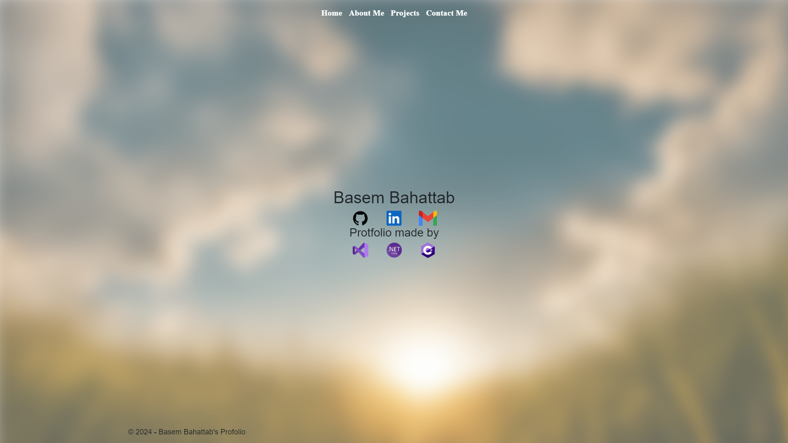
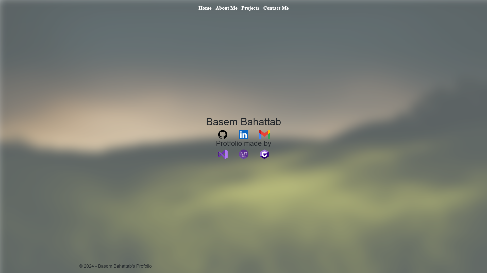

# Basem Bahattab Website Protfolio.  
### A nice clean Portfolio Website. Which contain must of the information you need to know. The UI on the website responsive to must screens.  

## You are welcome to try:
<a href="https://profolioaspnetmvc20240709234746.azurewebsites.net/">Click me. (Deployed to Azure)</a>

## Website Features

### Dynamic Background
- The website's background changes based on the current time, providing a day or night theme. This is achieved using JavaScript's `new Date()` function.
  - 
  - 

### Custom Swiper Integration
- **Vertical Swiper:** On the "About Me" and "Projects" pages, you can navigate by simply scrolling up or down with the mouse wheel to move between sections.
- **Image Gallery:** In the "Projects" page, projects with multiple images allow you to click on the left or right side of the image to view additional images.

### Additional Features
- **Resume Access:** In the "About Me" page, clicking on the CV link will direct you to a website where you can view and download the resume more clearly.
- **GitHub Repositories:** In the "Projects" page, each project's header is clickable, taking you directly to the project's GitHub repository.

---

### 📄 My Experiences
- **Resume:** My resume is accessible in the "About Me" page.
- **Highlighted Work:** My notable projects are showcased in the "Projects" page.

  
### Languages and Tools:
- <a href="https://visualstudio.microsoft.com/" target="_blank" rel="noreferrer"> - Visual Stuido 2022 </a>
- <a href="https://dotnet.microsoft.com/en-us/apps/aspnet" target="_blank" rel="noreferrer"> ASP.NET Core </a>  
- <a href="https://dotnet.microsoft.com/en-us/languages/csharp" target="_blank" rel="noreferrer"> C# </a>
- <a href="https://getbootstrap.com/" target="_blank" rel="noreferrer"> Bootstrap </a> 

